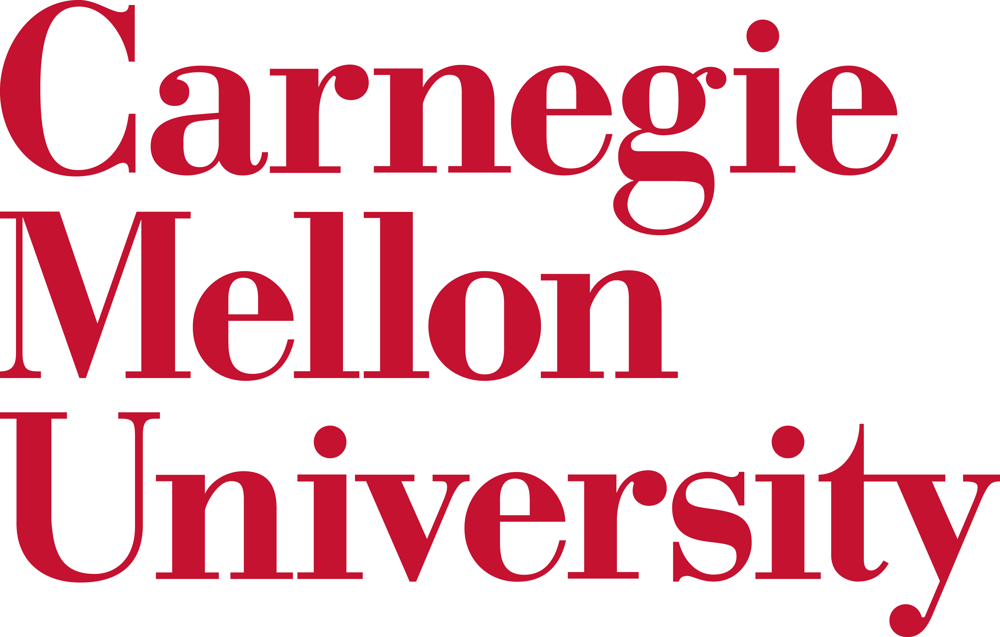
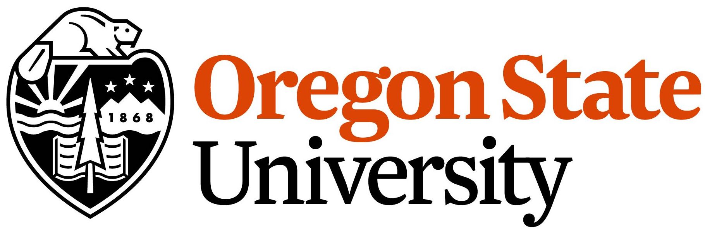
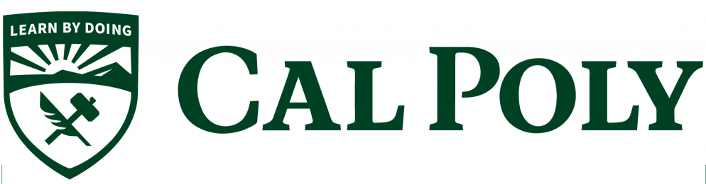

|      | ||

|| Fall 2025 | 17-200 Introduction to Software Construction |
|| Fall 2025 | 15-890 Computer Science Pedagogy |
|| Fall 2025 | 17-313  Foundations of Software Engineering |
|| Spring 2025 | 17-313  Foundations of Software Engineering |
|| Spring 2025 | 17-950 Crafting Software |
|| Fall 2024 | 07-120 Introduction to Software Construction |
|| Fall 2024 | 15-890 Computer Science Pedagogy |
|| Fall 2024 | 17-313  Foundations of Software Engineering |
|| Spring 2024 | 17-313  Foundations of Software Engineering |
|| Spring 2024 | 17-950 Crafting Software |
|| Fall 2023 | 07-120 Introduction to Software Construction |
|| Fall 2023 | 15-890 Computer Science Pedagogy | 
|| Summer 2023 | 99-519 Collaborative Research through Projects |
|| Spring 2023 | 17-356 Software Engineering for Startups |
|| Spring 2023 | [17-313 Foundations of Software Engineering](https://cmu-313.github.io/) |
|| Fall 2022 | 17-313 Foundations of Software Engineering |
|| Fall 2022 | 17-623 Quality Assurance |
|| Spring 2022 | 17-950 Crafting Software |
|| Spring 2022 | 17-356 Software Engineering for Startups |
|| Spring 2022 | 15-890 CS pedagogy |
|| Fall 2021 | 17-313 Foundations of Software Engineering |
|| Fall 2021 | 17-625 Design Patterns & API Design |
|| Spring 2021 &nbsp;&nbsp;&nbsp;&nbsp;&nbsp;&nbsp;&nbsp;&nbsp;&nbsp;&nbsp;| 17-450/950  [Crafting Software](https://cmu-crafting-software.github.io/) | 
|| Spring 2021 | 17-356 Software Engineering for Startups | 
|| Fall 2020 | 17-400 - Data Science and Machine Learning at Scale | 
|| Fall 2020 | 17-313 Foundations of Software Engineering |
|| Spring 2020 | 15-890 CS pedagogy |
|| Spring 2020 | 17-356 Software Engineering for Startups |
|| Spring 2020 | 17-413 Software Engineering Practicum  |
|| Fall 2019 | 17-437 Web Application Development |
|| Fall 2019 | [17-313 Foundations of Software Engineering ](https://www.cs.cmu.edu/~ckaestne/15313/) |
|| Spring 2019 | [17-214 Principles of Software System Construction](http://www.cs.cmu.edu/~mhilton/classes/17-214/s19/) | 
|| Spring 2019 | 17-413 Software Engineering Practicum | 
|| Spring 2019 | 17-356 Software Engineering for Startups | 
|| Fall 2018 | [17-313 Foundations of Software Engineering](https://www.cs.cmu.edu/~ckaestne/15313/) |  
|| Fall 2018 | 15-539 CS pedagogy |
|| Spring 2018 | 17-356 Software Engineering for Startups |
|| Spring 2018 | 17-413 Software Engineering Practicum |
|| Fall 2017 |  [15-214 Principles of Software System Construction](http://www.cs.cmu.edu/~charlie/courses/15-214/2017-fall/)   | 
|      ||| 
| | Spring 2016 |  CS361: Software Engineering |  
|      |||
| | Spring 2013 |  CSC/CPE 101 Fundamentals of Computer Science I | 
